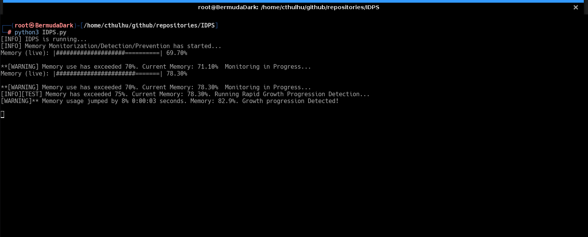
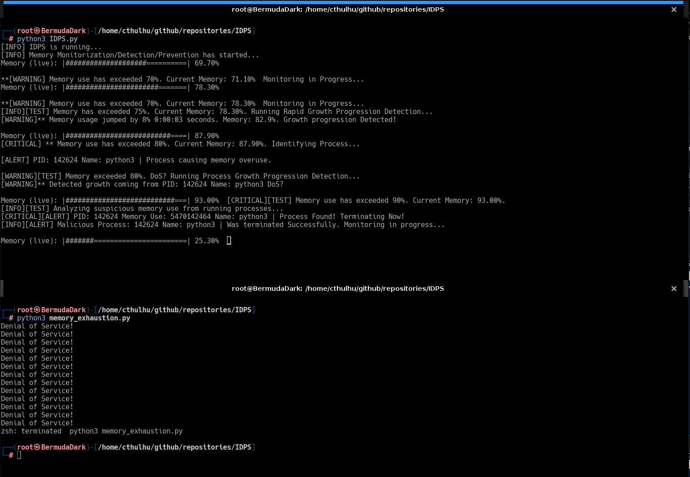

<h1>Memory Exhaustion DoS Simulation and IDPS</h1>

<h2>Description</h2>
Project consists of a simple Python script demonstrating a **Denial of Service (DoS)** attack via **Memory Exhaustion** and an accompanying Intrusion Detection/Prevention System designed to detect, log, and automatically terminate the malicious process.
This project was developed as a proof-of-concept for a college (Cloud Security) course to practically explore system monitoring and automated threat response.
<br />


<h2>Languages and Libraries Used</h2>

- <b>Python 3.13.3</b> 
- <b>logging, os, signal, time, datetime, psutil</b>

<h2>Environments Used </h2>

- <b>Kali Linux VM</b>

<h2>Project Overview</h2>
<h3>1. DoS Simulation ('memory_exhaustion.py')</h3>
Attack Vector: The script employs a technique similar to a 'stack smashing' or 'memory bloat' attack.
Payload: Inside `dos_RAM()`, it creates a massive array and repeatedly appends the string `"AA"`. The script is configured to allocate approximately **50MB** (52,428,800 bytes) of memory per iteration, rapidly consuming the host system's RAM.
<br />
<h3>2. The IDPS (IDPS.py)</h3>
This script runs concurrently with the DoS script, actively monitoring the system's performance metrics and enforcing security policies. 
<br />
<p></p>
<b>**Detection and Prevention Logic (The Anomaly Rules)**</b>
<br />
<br />
The IDPS uses a multi-stage, percentage-based threshold system to detect the anomaly and initiate prevention:

| Rule | Trigger Threshold | Action / Alert |
| :--- | :--- | :--- |
| **Rule #1** | **70%** Total Memory Use | **WARNING:** Starts intensive monitoring. |
| **Rule #2** | **75%** Total Memory Use | **TEST/WARNING:** Runs **Rapid Growth Progression Detection**. Checks for system-wide memory growth of **8%** within 3 seconds. |
| **Rule #3** | **80%** Total Memory Use | **CRITICAL:** Identifies the **highest memory-consuming PID** (e.g., the malicious script). Runs a **Process Growth Progression Detection** (6% growth in 3 seconds for that specific process). |
| **Rule #4** | **90%** Total Memory Use | **CRITICAL:** The final fail-safe. Identifies the top PID and automatically issues a **`os.kill()`** with `signal.SIGTERM` to **terminate the malicious process**. |

The entire process is logged to a file (`RAM.log`) with detailed timestamps and severity levels (`INFO`, `WARNING`, `CRITICAL`) for post-incident analysis.

<h2>Project Walkthrough:</h2>

<p align="center">
Launch the 'IDPS' utility: <br/>

<br />
<br />
Launch the DoS utility:  <br/>

<br />
<br />
The project is running. Just observe the IDPS detection output until completion.<br/>

<br />
<br />
You can also open the logs and watch alerts in real time. ** Recommend opening in VSCode for color labels**<br/>

<br />
<br />
Final Output. The script should have identified the malicious process using up the ram and handle it accordingly. Since this is a mock securit solution, the script will continue monitoring memory until manual termination.<br/>

<br />
<br />


<!--
 ```diff
- text in red
+ text in green
! text in orange
# text in gray
@@ text in purple (and bold)@@
```
--!>
